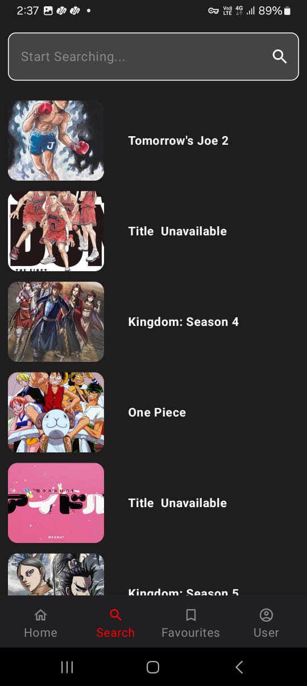

<h1>Anilab</h1>

<h2>🎯 Overview </h2>

An <strong>Anime Info App</strong> designed to provide detailed information about various anime series. The app fetches data from the <strong>Jikan API</strong> using Retrofit and offers a sleek, modern UI built with Jetpack Compose. It efficiently handles server-side exceptions and ensures a smooth user experience with lightweight performance and robust architecture.

<h2>🤔 Features</h2>
<ul>
    <li><strong>Modern UI</strong>: Built with <strong>Jetpack Compose</strong> for dynamic, responsive, and visually appealing interfaces.</li>
    <li><strong>Jikan API Integration</strong>: Fetch real-time anime data including titles, seasons, descriptions, and ratings.</li>
    <li><strong>Exception Handling</strong>: Robust error management for server-side issues and network failures.</li>
    <li><strong>Lightweight Design</strong>: Optimized performance with minimal resource consumption.</li>
    <li><strong>Advanced Architecture</strong>: Utilizes <strong>Hilt</strong> for dependency injection, <strong>Flow</strong> and <strong>Coroutines</strong> for asynchronous operations, and <strong>LiveData</strong> for UI updates.</li>
    <li><strong>Search & Filters</strong>: Quickly find anime by title, season, or genre (as seen in the search and filter screens).</li>
</ul>

<h2>🌟 Benefits</h2>
<ul>
    <li><strong>User-Friendly</strong>: Intuitive navigation with tabs for Home, Favorites, and Search.</li>
    <li><strong>Reliable Data</strong>: Accurate information sourced from the Jikan API.</li>
    <li><strong>Fast & Efficient</strong>: Smooth performance even on low-end devices.</li>
    <li><strong>Modern Tools</strong>: Leverages Kotlin and Jetpack libraries for future-proof development.</li>
    <li><strong>Offline Capability</strong>: Locally cached data for limited offline access (if implemented with Room DB).</li>
    <li><strong>Error Resilience</strong>: Clear prompts for network issues or missing content.</li>
</ul>

<h2>📸 Screenshots</h2>

    
    
    
  

    
    
    
  

<h2>🛠️ Languages & Technologies</h2>
<ul>
    <li><strong>Language</strong>: Kotlin</li>
    <li><strong>Technologies</strong>: Jetpack Compose, Retrofit, Hilt, Flow, Coroutines, LiveData,Room Database </li>
</ul>

<h2>⬇ Download Here</h2>

